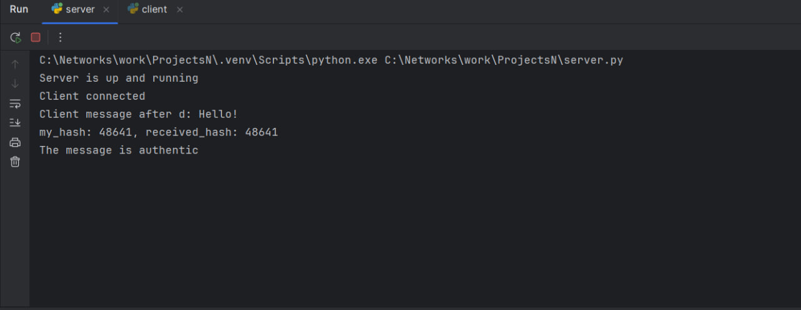
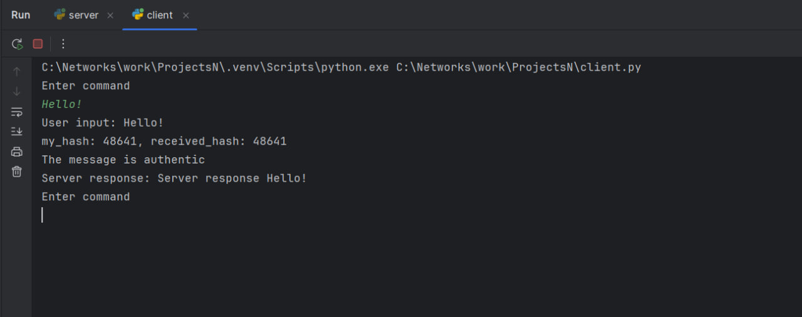

# Encrypted Socket Communication

A secure client-server communication system implementing multiple layers of cryptographic protocols to ensure confidential and authenticated message exchange.

## Overview

This project demonstrates a practical implementation of secure socket communication using a combination of industry-standard cryptographic techniques. It provides end-to-end encryption and message authentication between a client and server over TCP sockets.

## Key Features

- **🔐 Secure Key Exchange**: Diffie-Hellman algorithm for establishing a shared secret without transmitting it over the network
- **✍️ Digital Signatures**: RSA-based signature system for message authentication and integrity verification
- **🔒 Symmetric Encryption**: Custom block cipher using XOR operations and lookup table substitution
- **🛡️ Message Authentication**: MAC (Message Authentication Code) implementation to prevent message tampering
- **🔌 Socket-based Communication**: TCP/IP socket programming for reliable client-server interaction

## Architecture

The system consists of three main components:

1. **`protocol.py`**: Core cryptographic functions and protocol definitions
2. **`server.py`**: Server implementation that listens for client connections
3. **`client.py`**: Client implementation for initiating secure communication

### Security Layers

```
┌─────────────────────────────────────────────┐
│         Application Layer (Messages)        │
├─────────────────────────────────────────────┤
│    Custom Symmetric Encryption (XOR-based)  │
├─────────────────────────────────────────────┤
│   RSA Digital Signatures (Authentication)   │
├─────────────────────────────────────────────┤
│  Diffie-Hellman (Key Exchange) - Shared Key │
├─────────────────────────────────────────────┤
│           TCP Socket Transport              │
└─────────────────────────────────────────────┘
```

## Cryptographic Protocols

### 1. Diffie-Hellman Key Exchange
- Establishes a shared secret between client and server
- Uses a 16-bit private key
- Provides forward secrecy for the session

### 2. RSA Digital Signatures
- Each party generates RSA key pairs (public/private)
- Messages are signed with the sender's private key
- Signatures are verified using the sender's public key
- Uses 9-bit prime numbers (P and Q) for key generation

### 3. Custom Symmetric Encryption
- Block cipher operating on 4-byte blocks
- Uses a 16-bit shared key derived from Diffie-Hellman
- Four-stage encryption process:
  1. XOR with key
  2. Substitution using lookup table
  3. Cyclic shift
  4. XOR with key again

### 4. Message Authentication
- Hash function generates 16-bit message digest
- RSA signature on hash creates MAC
- Prevents message tampering and ensures authenticity

## Installation

### Prerequisites
- Python 3.x
- Standard Python libraries (socket, random, math, base64)

### Setup
```bash
git clone https://github.com/Yshaul2000/encrypted-socket-communication.git
cd encrypted-socket-communication
```

No additional dependencies required - uses only Python standard library.

## Usage

### Starting the Server
```bash
python server.py
```
The server will start listening on port 8820 and wait for client connections.

### Running the Client
```bash
python client.py
```
The client will connect to `127.0.0.1:8820` and initiate the secure handshake.

### Example Session
1. Server starts and listens for connections
2. Client connects and initiates Diffie-Hellman key exchange
3. Both parties exchange RSA public keys
4. Client can send encrypted and signed messages
5. Server responds with encrypted and authenticated messages
6. Type `EXIT` to terminate the connection

## Screenshots

### Server Output

*The server listening for connections, receiving and authenticating client messages*

### Client Output

*The client sending messages and receiving authenticated responses from the server*

## Protocol Flow

```
Client                                  Server
  |                                       |
  |-- DH Public Key ---------------------->|
  |<-------------------- DH Public Key ---|
  |  (Both calculate shared secret)       |
  |                                       |
  |-- RSA Public Key, N ------------------>|
  |<--------------- RSA Public Key, N ----|
  |                                       |
  |-- Encrypted Message + MAC ------------>|
  |     (Verify signature, decrypt)       |
  |<----------- Encrypted Response + MAC --|
  |  (Verify signature, decrypt)          |
  |                                       |
  |-- EXIT ------------------------------>|
  |                                       |
```

## Security Considerations

- **Educational Purpose**: This implementation is designed for learning and demonstration
- **Production Use**: Not recommended for production environments without further hardening
- **Key Sizes**: Uses smaller key sizes for demonstration (9-bit RSA primes, 16-bit DH keys)
- **Custom Cipher**: The symmetric encryption is a custom design and hasn't undergone formal security analysis

## Technical Details

- **Port**: 8820 (configurable in `protocol.py`)
- **DH Prime (P)**: 65521
- **DH Generator (G)**: 3
- **Signature Size**: 3 bytes
- **Block Size**: 4 bytes
- **Hash Size**: 16 bits

## Author

Yinon Shaul

## Feedback

We welcome any feedback, suggestions, or ideas for improvement!  
Feel free to open an issue and share your thoughts.

---

**Note**: This is an educational project demonstrating cryptographic concepts. For production applications, use established libraries like OpenSSL, cryptography.io, or similar industry-standard implementations.
